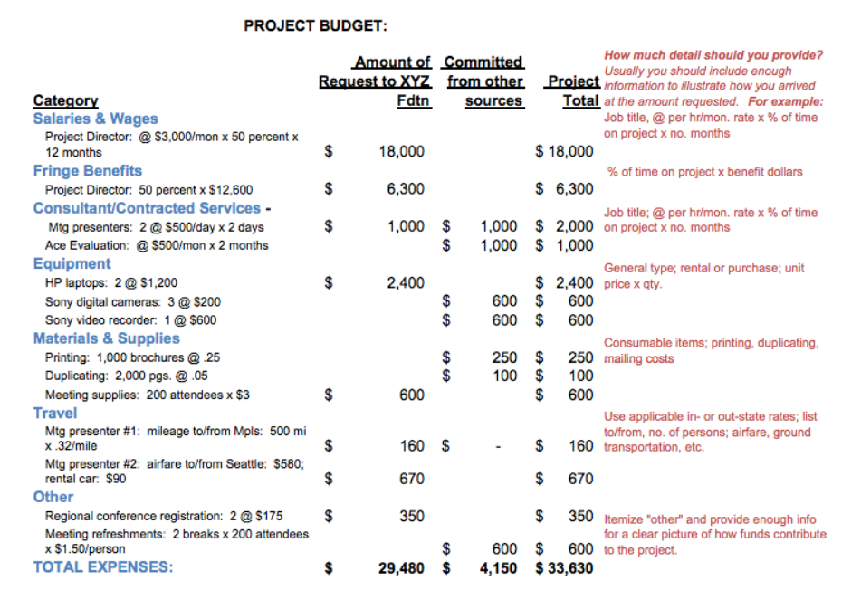

1. A logic model supports an outcomes-based approach to program planning and evaluation. T/F  
**True**

2. The number of classes taught, meetings held, or materials produced and distributed are considered:   
**Outputs**  
Inputs 
Activities  
 
3. Staff training in a logic model is an example of an:  
**Activity**  
Input  
Assumption  

4. Changes expected to result from program activities are considered  
Outputs  
**Outcomes**  
Activities  

5. An increase in the number of patients treated is an example of an output. T/F  
**False**

6. The amount being requested of XYZ Foundation is:  
$4,150  
**$29,480**  
$33,630  

7. The majority of the funding being requested from XYZ is for the salary and benefits expenses of the project director. T/F  
**True**

8. The full equipment budget for the entire project is $2,400. T/F  
**False**